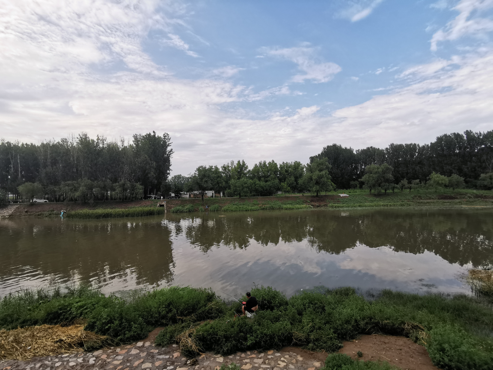
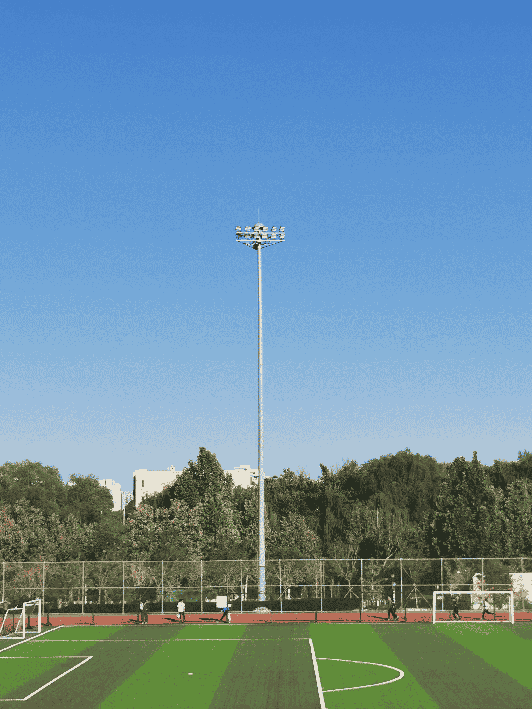
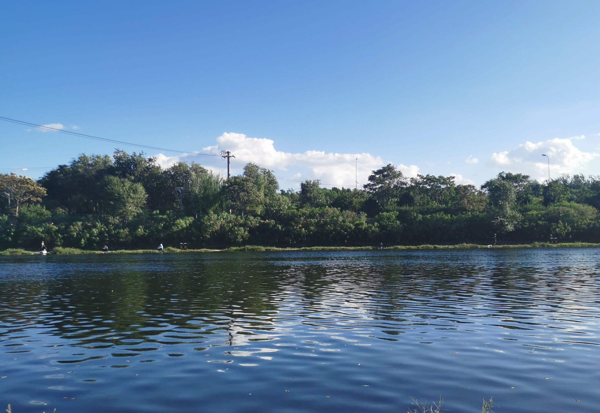
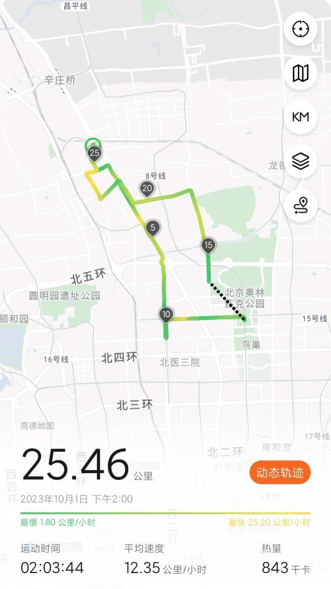
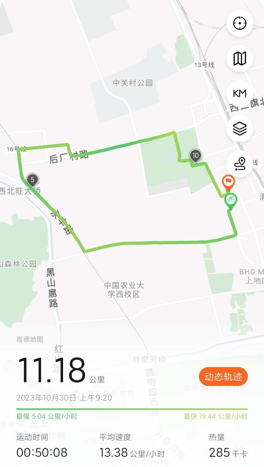
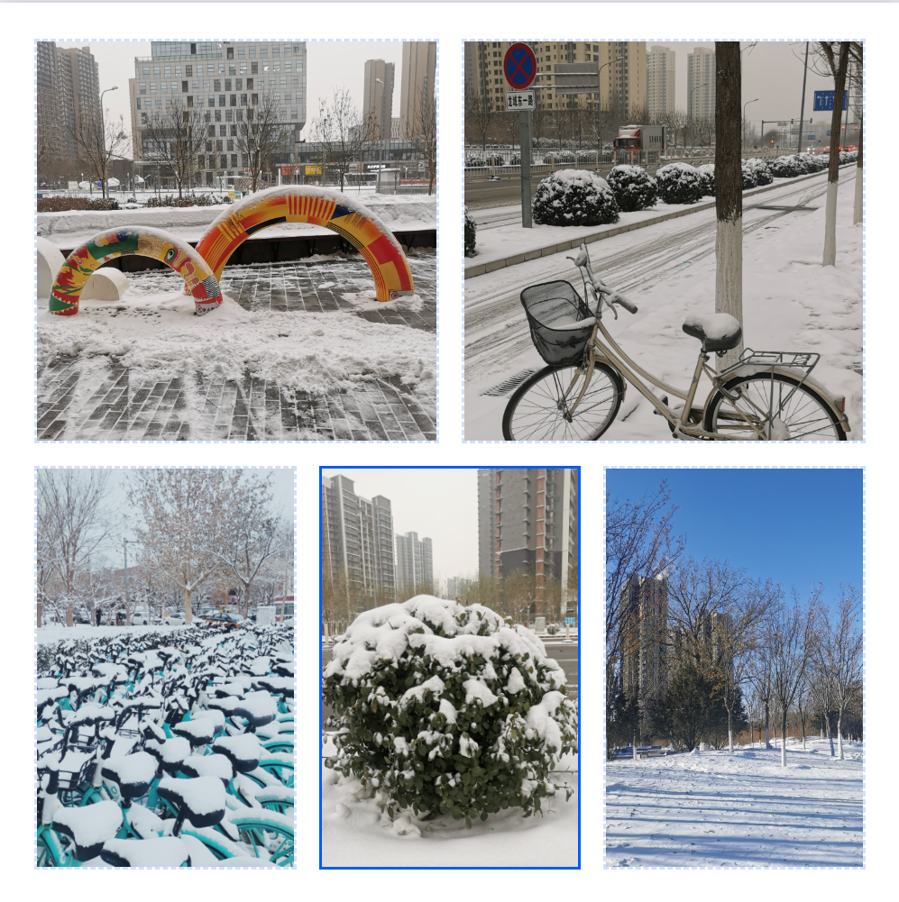

# 2023

想来已经好久没写一些总结的话，2023年已经过去了，回望这一年，记不起来多少动人心魄的事儿，一如既往地生活和工作，好像什么都没改变，但好像也做了很多。去年初给自己说的是“身体健康，则万事如意”，那么今年呢，秋末的体检结果显示我无比健康，若按去年的想法看，我今年也是无比如意的一年，但，除此之外，我还想再多聊点其他的东西。

## 一时难以回去的武汉

2023年春节很早，2月初就回来北京上班了

“我要回武汉定居，工作，生活，毕竟也是时候回去了。”，那是22年底的想法，所以 `准备简历` -> `刷题准备` -> `投递简历` -> `远程面试` -> `拿到Offer` -> `辞职` -> `回武汉` 这每一步都不能少，我当时想，顺利的话，5月底大概也就回去了，那时候房租也到期不再续。

准备一个月，和几个武汉企业面试沟通了一圈之后才发现，目前北京的工作环境是多么的难得，萌生退意的同时，老板给我晋升涨薪了，虽不同往年，但也把我从去往武汉的路上拦了下来，那就先在北京再呆一年了

我甚至在想，武汉还有必要回去么，回去一样是工作，并且占据了大部分时间，如果这大部分时间里都是郁郁寡欢不开心的状态，并且我从各个渠道了解到武汉的工作环境很差，工资是打折的，加班是无偿的，非法裁员是常见的，劳动力是无限的（大学很多），有时候，别人的话还是要听的，干嘛非要以身试险，后果也只能是自己承担，你，有多少退路可以选呢？

4月中旬，幸运涨薪，至此，回武汉的计划暂停

## 骑行·在路上

> 在我们物质生活极大丰富的今天，反而更觉得空虚了

6月份，我拥有了一辆正儿八经的公路车，自此，上下班骑车通行，周末骑车游玩儿

### 一个夏日午后，午睡醒来，雨过天晴，骑车去了南沙河

有人钓鱼，有人下河捉鱼，看着脏脏的河，也抵挡不住大家下嬉戏的热情

### 9月：骑行去海淀驾校

最长骑行记录，44公里

### 10月：国庆节假期，骑行

* 回龙观体育公园

当一个没有比赛的观众

* 去清河河边，看人钓鱼

* 去奥森凑热闹

### 一个工作日的早上

去公司太早，溜达一圈，再来上班

## 《漫长的季节》

> 空难发生的概率，和买彩票中奖的概率差不多，为什么那么多人会认为空难不会发生在自己身上，认为自己买彩票会中奖，人是乐观主义者吧？

今年看过的一部很喜欢的国产剧，我最爱的是那句话是 `向前走啊，别回头` ，今年也是我漫长的告别一年了

## 冬天 · 罕见大雪

12月上旬刚过不久，就开始连续下了两天的雪，不同往年（雪是以一个快闪的姿态出现，来的快，消失的也快），路上积雪了，这两天上班简直太快乐了，走着去，踩在雪上吱呀作响，路上行人不多，安静的很，这才是冬天该有的样子嘛。

这个冬天，下雪了，足矣

## 务实