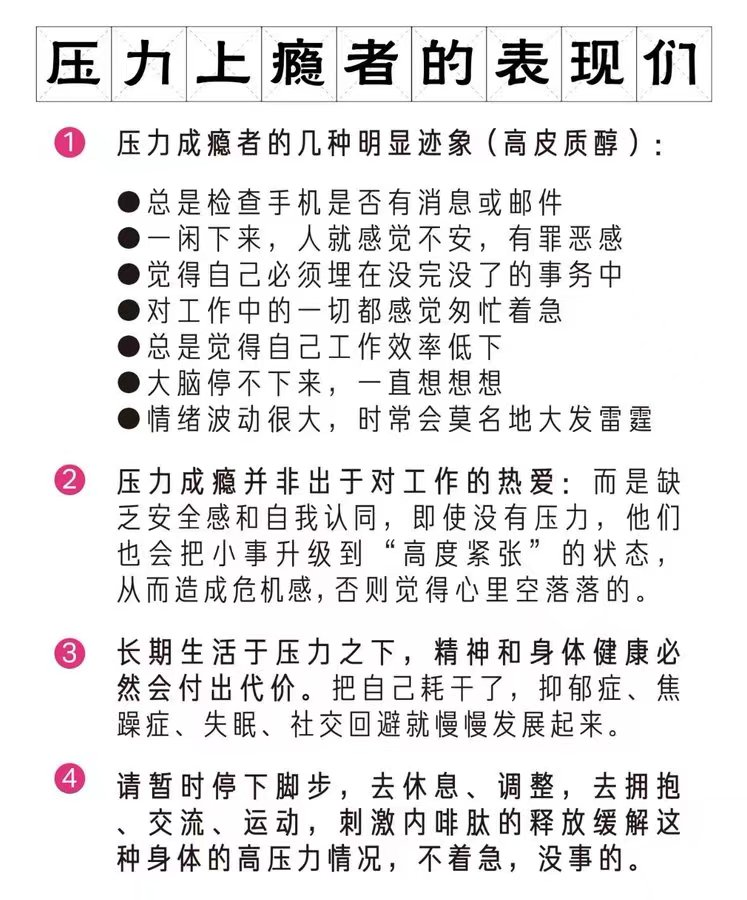

# 周五晚上

看了韩国电影《犯罪都市4》，没想到已经到4了，是一部轻喜剧爽片，没有催泪，内容比较轻松，很适合周末在家放心食用，这里是豆瓣的链接，[《犯罪都市4》](https://movie.douban.com/subject/36085987)

# 周六下午

乱翻看爱奇艺上的电影，发现了一部有着奇怪名字的电影，[《朱同在三年级丢失了超能力》](https://movie.douban.com/subject/35749842/)，然后就看了进去，严肃地搞笑电影，让人忍俊不禁

# 周日上午

看了《朱同在三年级丢失了超能力》这部电影的影评，发现了另外一部类似的电影[《树上有个好地方》](https://movie.douban.com/subject/30299040)，都是有关小学生的故事，出彩的是，在剧中我听到了赵雷的歌，一首是《让我偷偷看你》，一首是片尾出来的《我们的时光》，不得不说，和剧情很契合，也很应景，爱了爱了。

# 还有

这两天，不间断看了《唐朝诡事录之西行》，电视剧的质感，以及剧情都还可以

# 回家

在地铁上，我看到这样的一段话，与我甚是相似，我是有压力上瘾症状的么？值得思考一下
