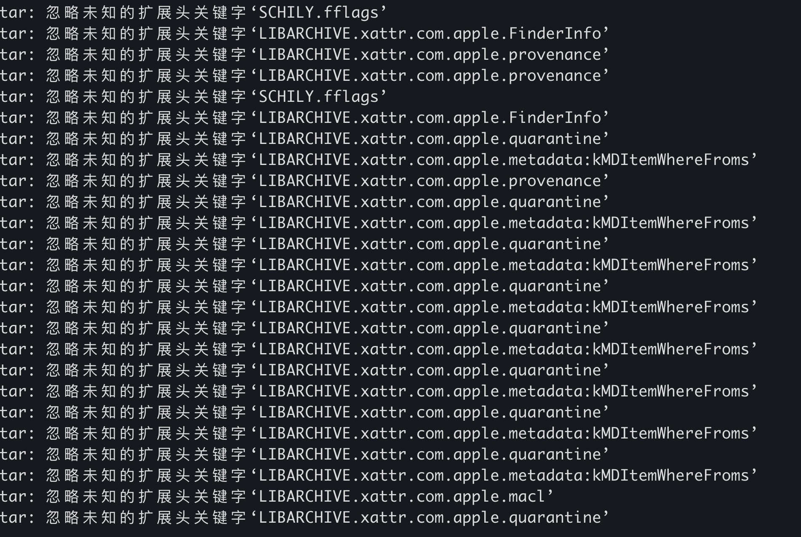

# 1. tar解包到指定的地址`-C`

可以覆盖&融入之前已有的文件（夹）

```shell
tar -xvf abc.tar -C /usr/local/dist
```


# 2. 忽略解包的时候报错

tar解压时候，有时候会出出现以下报错

可以使用如下参数忽略报错
```sh
tar -xvf abc.tar --warning=no-unknown-keyword
```

# 3. tar打包指定文件夹

```shell
tar -cvf /tmp/web-static.gz -C /the/target/dir/ .
```

