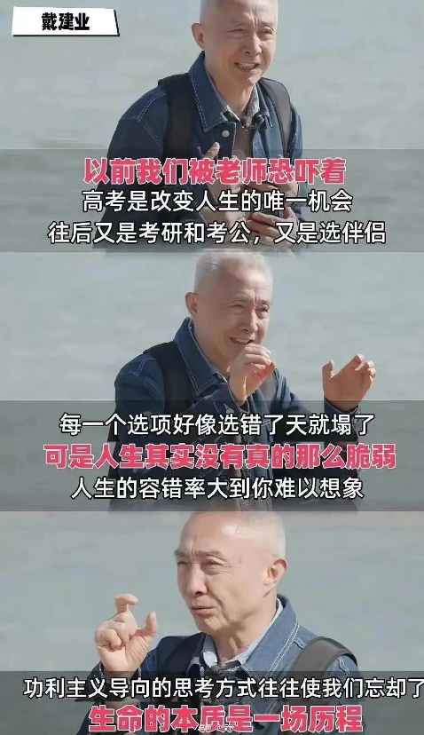
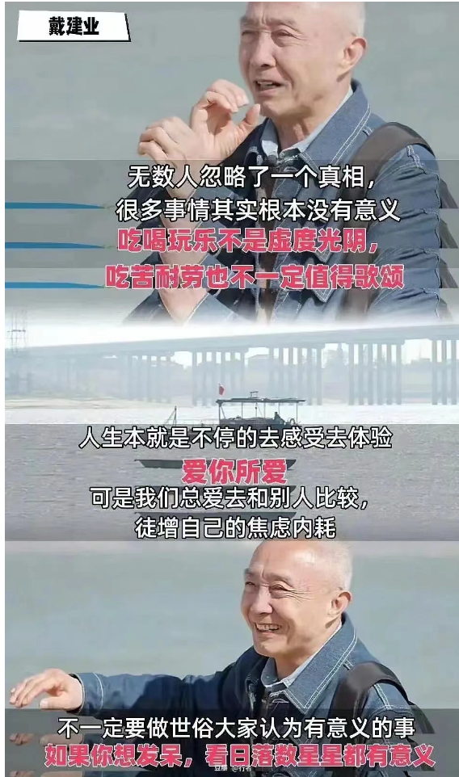
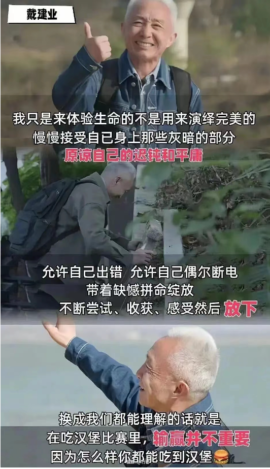

# 一、前言

  

## 敲黑板，看这里
- 专业：选一个适合自己的（偏功利点，偏实用的，偏理想主义的都没问题）
- 学校：选一个好看点的，现代点（那要待四年，不能委屈自己）
- 城市：不做建议（我知道你肯定是想离家`越远越好`，至少现在是想逃离父母身边）

# 二、志愿填报

## 【浙江】浙江科技大学

- 生物制药

## 【重庆】重庆科技大学

- 计算机科学与技术（可冲）
- 制药工程
- 智能制造工程

官网：[https://www.zust.edu.cn](https://www.zust.edu.cn)

##  【武汉】武汉轻工大学 

- 康复治疗学
- 动物药学
- 护理学

官网：[https://www.whpu.edu.cn](https://www.whpu.edu.cn)

## 【北京】中华女子学院

- 会计学（财务）
- 学前教育
- 数字媒体技术（属计算机类专业，[百度百科](https://baike.baidu.com/item/数字媒体技术/6512332)）

百度百科：[https://baike.baidu.com/item/中华女子学院/249628](https://baike.baidu.com/item/中华女子学院/249628)

## 【十堰】江汉师范学院

> 汉江师范学院的优师计划可以报，然后提前批不影响后面的普通本科志愿填报，但是提前批优势计划，出来直接有编制，就是在湖北其他县里任教6年

参考：[https://zjc.hjnu.edu.cn/info/1015/1472.htm](https://zjc.hjnu.edu.cn/info/1015/1472.htm)

